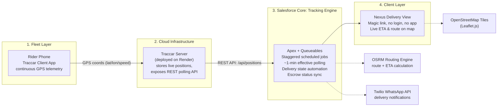
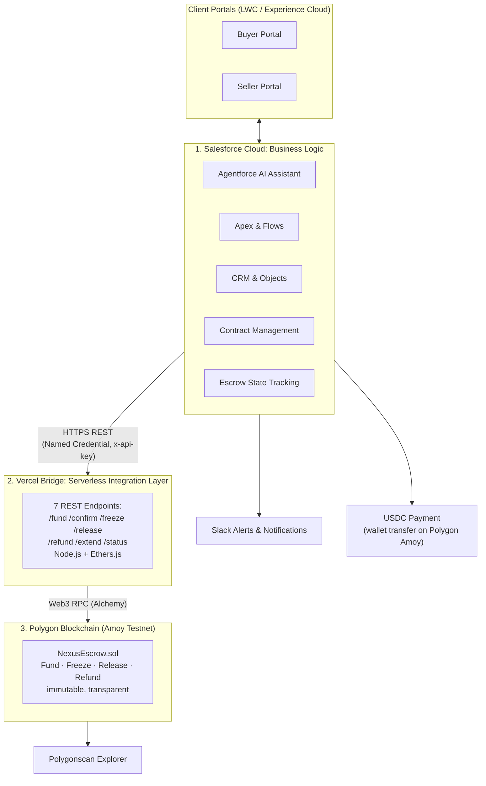
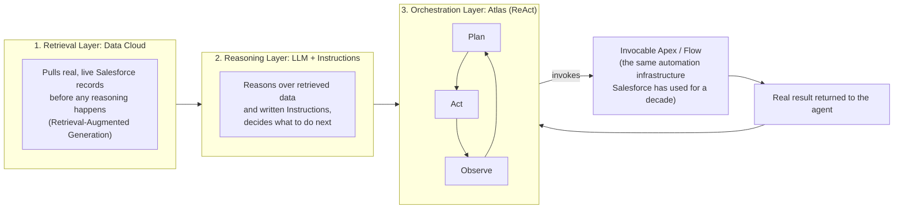

# Nexus: B2B/B2C Commerce Platform on Salesforce

Nexus is a full-lifecycle commerce platform built natively on Salesforce, extending the standard B2B/B2C Commerce and Experience Cloud stack with AI-driven sales intelligence, blockchain-secured escrow payments, live logistics tracking, and an integrated customer/partner portal.

It is designed as a single system of record spanning **lead → quote → order → payment → fulfillment → after-sales**, with a Lightning Web Component front end, 100+ Apex services, an Agentforce AI layer, and a set of off-platform microservices (Node/Express bridge, Solidity smart contracts) for capabilities Salesforce doesn't natively provide.

---

## Table of Contents

- [Architecture](#architecture)
- [AI Architecture (Agentforce)](#ai-architecture-agentforce)
- [Feature Areas](#feature-areas)
- [Tech Stack](#tech-stack)
- [Repository Structure](#repository-structure)
- [Getting Started](#getting-started)
- [Release Process & Environments](#release-process--environments)
- [CI/CD](#cicd)
- [Documentation](#documentation)
- [Live Demo](#live-demo)

---

## Architecture

### System Overview


### Live GPS Delivery Tracking

Real-time fleet visibility from the rider's phone to the customer's browser, with no app install required on the customer side.



### Web3 USDC Escrow

Salesforce owns the business logic and contract lifecycle; a serverless bridge is the only component that talks to the blockchain.



Detailed sequence diagrams for individual flows (authentication, quote generation, order processing, combo packages, Agentforce chatbot routing, etc.) are in [`docs/`](docs/) as PlantUML files.

---

## AI Architecture (Agentforce)

The platform uses two distinct AI layers, matched to two different problems:

- **Einstein**: classic predictive AI embedded directly in Apex (e.g. `LeadAIAnalysisUpdater`) for deterministic scoring tasks: lead scoring, quote acceptance likelihood, stock/demand prediction. Fast, explainable, no conversation involved.
- **Agentforce**: Salesforce's agentic AI layer, used where the system needs to reason over a conversation and take multi-step action (the customer support chatbot and quote negotiation subagents).

Agentforce itself runs a three-layer, autonomous architecture. It doesn't just answer from a static prompt, it retrieves live data and decides its own next action:



An **Agent** in this system is defined by three things: **Topics** (standard or custom, what the agent is allowed to reason about), **Actions** (standard or custom, what it's allowed to actually do), and **Instructions** (how it should behave). Agent quality is validated using Salesforce's built-in Testing Center: automated test suites run real utterances against each subagent (e.g. the `Quote Negotiation` subagent) and score topic classification, action accuracy, and response correctness before anything ships.

---

## Feature Areas

| Area | Highlights |
|---|---|
| **Sales & CRM** | Lead capture, Einstein-assisted lead scoring, opportunity → quote → contract lifecycle, account/team management for B2B buyers |
| **AI & Automation** | Agentforce chatbot with subagent delegation and human handoff (Atlas ReAct reasoning over live Data Cloud retrieval), Einstein-based lead scoring and quote acceptance scoring, AI-driven stock/demand intelligence |
| **Commerce** | Product catalog with stock levels, combo package builder, discount/"Sparks" engine, cart & checkout, Stripe hosted checkout |
| **Payments** | Stripe (card) and a hybrid Web3 escrow flow: USDC held in a Solidity smart contract, released on delivery confirmation |
| **Logistics** | Live GPS shipment tracking, digital ownership passport per item, swap/resale marketplace between customers |
| **Contracts & Docs** | DocuSign-based quote/contract signing with auto PDF attachment, renewal & amendment workflows |
| **Customer Portal** | Experience Cloud site for B2B and B2C customers, covering order history, quotes, escrow status, support case tracking |
| **Notifications** | Twilio SMS, transactional email templates, in-app bell notifications and activity feed |
| **Analytics** | Power BI-backed reporting on sales, stock, and platform activity |

---

## Tech Stack

| Layer | Technology |
|---|---|
| Platform | Salesforce (Lightning Platform, Experience Cloud, Agentforce) |
| Front end | Lightning Web Components (LWC), SLDS |
| Back end | Apex (services, triggers, batch/queueable/schedulable jobs) |
| AI | Agentforce agents & subagents, Einstein |
| Payments | Stripe API, Solidity smart contract (NexusEscrow), Hardhat |
| Bridge service | Node.js / Express, deployed as Vercel serverless functions |
| Integrations | DocuSign, Twilio, Power BI |
| CI/CD | Salesforce DevOps Center (release pipeline), GitHub Actions, Salesforce CLI |
| Tooling | ESLint, Prettier, Jest (`sfdx-lwc-jest`), Husky pre-commit hooks |

---

## Repository Structure

```
force-app/main/default/   Salesforce metadata: LWC, Apex, objects, flows, permission sets
blockchain/                Solidity smart contracts (NexusEscrow) + Hardhat project
bridge/                    Node/Express serverless bridge between Salesforce and the blockchain
docs/                      PlantUML sequence diagrams and feature documentation
manifest/, destructive/    Deployment manifests and destructive change packages
scripts/                   Reusable anonymous Apex utilities (data import, permission setup)
.github/workflows/         CI pipelines: PR validation, QA deploy, production deploy
```

---

## Getting Started

### Prerequisites
- [Salesforce CLI](https://developer.salesforce.com/tools/salesforcecli)
- A Salesforce org (Developer Edition, sandbox, or scratch org)
- Node.js 18+ (for the bridge service and blockchain tooling)

### 1. Deploy the Salesforce metadata
```bash
sf org login web --alias my-org
sf project deploy start --target-org my-org --source-dir force-app
```

### 2. (Optional) Set up the blockchain escrow contract
```bash
cd blockchain
npm install
cp .env.example .env      # fill in ALCHEMY_API_KEY, DEPLOYER_PRIVATE_KEY, etc.
npm run deploy:testnet
```

### 3. (Optional) Run the bridge service
```bash
cd bridge
npm install
cp .env.example .env      # fill in PLATFORM_PRIVATE_KEY, contract addresses, BRIDGE_API_KEY
npm run dev
```
Point a Salesforce Named Credential at the deployed bridge URL, using the same key as `BRIDGE_API_KEY`.

### 4. Lint & test
```bash
npm install
npm run lint
npm run test:unit
```

Every `.env.example` file in this repo documents the exact variables its component needs. Copy it to `.env` and fill in real values locally; `.env` itself is git-ignored.

---

## Release Process & Environments

Salesforce releases are managed with **Salesforce DevOps Center**, Salesforce's native, in-platform release management tool (built on Salesforce DX and the Metadata API). Rather than relying purely on an external CI tool, DevOps Center provides a visual pipeline that connects this GitHub repository to a sequence of Salesforce orgs and tracks each change as a **Work Item**.

| Stage | Org type | Branch | Purpose |
|---|---|---|---|
| Development | Developer org / scratch org | feature branches (`WI-0000x`) | Build and unit-test an individual feature |
| QA | Sandbox | `qa` | Integration testing; auto-deployed by `deploy-qa.yml` |
| Production | Production org | `main` | Live environment; deployed manually via `deploy-prod.yml` with explicit confirmation |

**How a change moves through the pipeline:**
1. A feature is scoped as a **Work Item** (e.g. `WI-000003`) in DevOps Center, which creates and tracks its feature branch.
2. Metadata changes are made against a Development org and retrieved into source format in that branch.
3. DevOps Center generates the pull request to promote the Work Item into `qa`. `validate-pr.yml` runs a dry-run deploy against the target org before the PR can merge; on merge, `deploy-qa.yml` deploys it to the QA sandbox.
4. Once verified in QA, the same Work Item is promoted to `main` and deployed to Production through a manually triggered, explicitly confirmed `deploy-prod.yml` run.

The `WI-000001`–`WI-000005` branches and the `PipelineTest` custom label in this repo are artifacts of that promotion pipeline.

---

## CI/CD

GitHub Actions handle the automated validation and deployment steps that DevOps Center's pipeline triggers:

| Workflow | Trigger | Purpose |
|---|---|---|
| `validate-pr.yml` | Pull request into `qa` or `main` | Validates the metadata deploy against the target org without deploying |
| `deploy-qa.yml` | Push to `qa` | Deploys to the QA sandbox |
| `deploy-prod.yml` | Manual (`workflow_dispatch`) | Deploys to production, requires explicit confirmation input |

---

## Documentation

- [`docs/README_Sequence_Diagrams.md`](docs/README_Sequence_Diagrams.md): index of all sequence diagrams
- [`docs/PART1_Diagramme_Classes.md`](docs/PART1_Diagramme_Classes.md): class-level design documentation

---

## Live Demo

A customer-facing Experience Cloud instance is available for evaluation:

**[Nexus Customer Portal](https://orgfarm-56b3b63a30-dev-ed.develop.my.site.com/ss/s/)**

This runs on a Salesforce Developer org, so availability isn't guaranteed long-term; please reach out if the link is stale, and see [Getting Started](#getting-started) to deploy your own instance.
