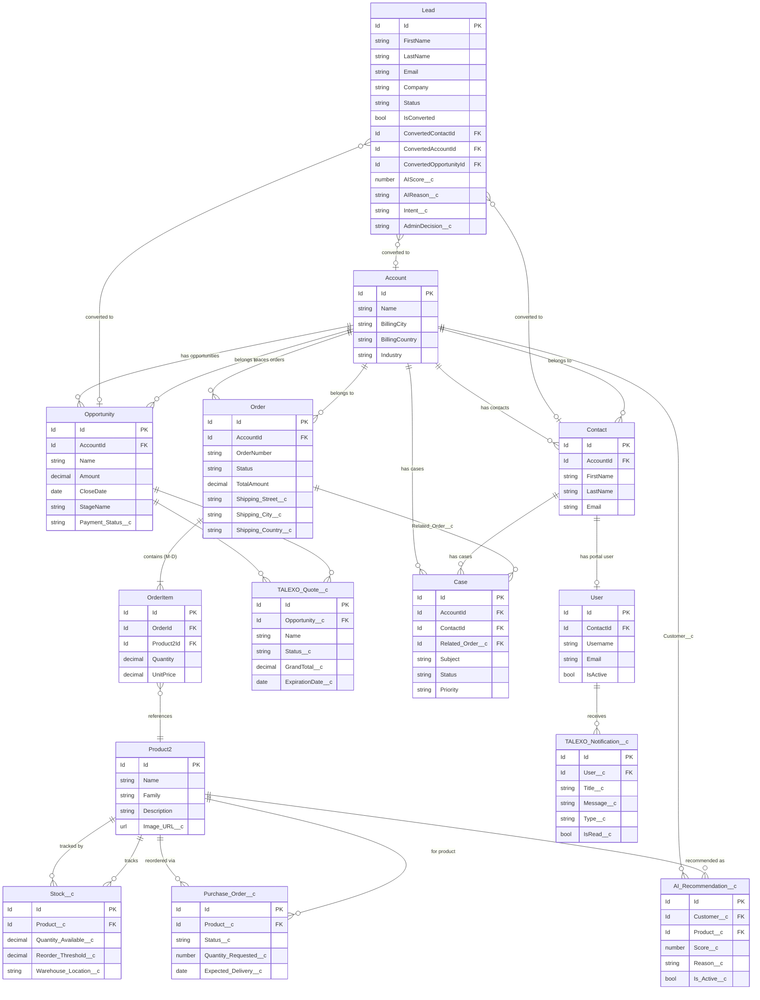

# NEXUS — Partie 1 : Classes, Objets, Champs & Relations

> Plateforme : Salesforce Experience Cloud B2B
> Date : 2026-03-16

---

## TABLE DES MATIÈRES

1. [Objets Custom — Création & Configuration complète](#1-objets-custom)
2. [Objets Standard — Champs custom ajoutés](#2-objets-standard-étendus)
3. [Relations entre tous les objets](#3-relations--diagramme)
4. [Classes Apex — Structure & Rôle](#4-classes-apex)
5. [Diagramme de classes global (Mermaid)](#5-diagramme-global)

---

## 1. OBJETS CUSTOM

### Comment créer un objet custom (Setup)
```
Setup → Object Manager → Create → Custom Object
```
Pour chaque objet ci-dessous : créer l'objet, puis ajouter chaque champ via
```
Object Manager → [Objet] → Fields & Relationships → New
```

---

### 1.1 — Stock__c

**Création de l'objet**
| Paramètre | Valeur |
|-----------|--------|
| Label | Stock |
| Plural Label | Stocks |
| Object Name | Stock__c |
| Name Field | Text — "Stock Name" |
| Sharing Model | ReadWrite |
| Allow Reports | No |
| Allow Activities | No |
| Deployment Status | Deployed |

**Champs à créer**

| API Name | Label | Type | Config |
|----------|-------|------|--------|
| `Product__c` | Product | **Lookup** → Product2 | Required: No · Delete: Set Null · RelationshipName: Stocks |
| `Quantity_Available__c` | Quantity Available | **Number** | Length: 18 · Decimals: 2 |
| `Reorder_Threshold__c` | Reorder Threshold | **Number** | Length: 18 · Decimals: 2 |
| `Warehouse_Location__c` | Warehouse Location | **Text** | Length: 255 |
| `Forecasted_Demand__c` | Forecasted Demand | **Number** | Length: 18 · Decimals: 0 |
| `Last_Sync_Date__c` | Last Sync Date | **Date/Time** | — |
| `AI_Risk_Summary__c` | AI Risk Summary | **Long Text Area** | Length: 32768 |

**Métadonnée XML complète** → [objects/Stock__c/Stock__c.object-meta.xml](../force-app/main/default/objects/Stock__c/Stock__c.object-meta.xml)

---

### 1.2 — TALEXO_Quote__c

**Création de l'objet**
| Paramètre | Valeur |
|-----------|--------|
| Label | TALCORE Quote |
| Plural Label | TALCORE Quotes |
| Object Name | TALEXO_Quote__c |
| Name Field | **AutoNumber** — Format: `DEVIS-{0000}` |
| Sharing Model | ReadWrite |
| Deployment Status | Deployed |

**Champs à créer**

| API Name | Label | Type | Config |
|----------|-------|------|--------|
| `Opportunity__c` | Opportunity | **Lookup** → Opportunity | Required: No · RelationshipName: Quotes · RelationshipLabel: TALCORE Quotes |
| `Status__c` | Status | **Picklist** | Restricted · Values ↓ |
| `GrandTotal__c` | Grand Total | **Currency** | Length: 16 · Decimals: 2 |
| `ExpirationDate__c` | Expiration Date | **Date** | — |
| `Description__c` | Description | **Long Text Area** | Length: 32768 |

**Valeurs Picklist Status__c**
| API Value | Label | Default |
|-----------|-------|---------|
| `Draft` | Draft | ✅ oui |
| `Sent` | Sent | non |
| `Presented` | Presented | non |
| `Accepted` | Accepted | non |
| `Rejected` | Rejected | non |

**Métadonnée XML complète** → [objects/TALEXO_Quote__c/](../force-app/main/default/objects/TALEXO_Quote__c/)

---

### 1.3 — TALEXO_Notification__c

**Création de l'objet**
| Paramètre | Valeur |
|-----------|--------|
| Label | TALCORE Notification |
| Plural Label | TALCORE Notifications |
| Object Name | TALEXO_Notification__c |
| Name Field | **AutoNumber** — Format: `NOTIF-{0000}` |
| Sharing Model | ReadWrite |
| Deployment Status | Deployed |

**Champs à créer**

| API Name | Label | Type | Config |
|----------|-------|------|--------|
| `User__c` | User | **Lookup** → User | Required: No · RelationshipName: Notifications |
| `Title__c` | Title | **Text** | Length: 255 |
| `Message__c` | Message | **Long Text Area** | Length: 32768 |
| `Type__c` | Type | **Picklist** | Values: Info · Success · Warning · Error |
| `IsRead__c` | Is Read | **Checkbox** | Default: false |
| `RelatedUrl__c` | Related URL | **URL** | Length: 255 |

**Métadonnée XML complète** → [objects/TALEXO_Notification__c/](../force-app/main/default/objects/TALEXO_Notification__c/)

---

### 1.4 — Purchase_Order__c

**Création de l'objet**
| Paramètre | Valeur |
|-----------|--------|
| Label | Purchase Order |
| Plural Label | Purchase Orders |
| Object Name | Purchase_Order__c |
| Name Field | Text — "Purchase Order Name" |
| Sharing Model | ReadWrite |
| Allow Reports | No |
| Deployment Status | Deployed |

**Champs à créer**

| API Name | Label | Type | Config |
|----------|-------|------|--------|
| `Product__c` | Product | **Lookup** → Product2 | Required: No |
| `Status__c` | Status | **Picklist** | Values: Pending · Ordered · Received · Cancelled |
| `Quantity_Requested__c` | Quantity Requested | **Number** | Length: 18 · Decimals: 0 |
| `Expected_Delivery__c` | Expected Delivery | **Date** | — |
| `Supplier__c` | Supplier | **Text** | Length: 255 |

**Métadonnée XML complète** → [objects/Purchase_Order__c/](../force-app/main/default/objects/Purchase_Order__c/)

---

### 1.5 — AI_Recommendation__c

**Création de l'objet**
| Paramètre | Valeur |
|-----------|--------|
| Label | AI Recommendation |
| Plural Label | AI Recommendations |
| Object Name | AI_Recommendation__c |
| Name Field | Text — "AI Recommendation Name" |
| Sharing Model | ReadWrite |
| Allow Search | Yes |
| Deployment Status | Deployed |

**Champs à créer**

| API Name | Label | Type | Config |
|----------|-------|------|--------|
| `Customer__c` | Customer | **Lookup** → Account | Required: No · RelationshipName: AI_Recommendations |
| `Product__c` | Product | **Lookup** → Product2 | Required: No · RelationshipName: AI_Recommendations |
| `Score__c` | Score | **Number** | Length: 5 · Decimals: 2 |
| `Reason__c` | Reason | **Long Text Area** | Length: 32768 |
| `Generated_Date__c` | Generated Date | **Date/Time** | — |
| `Is_Active__c` | Is Active | **Checkbox** | Default: true |

**Métadonnée XML complète** → [objects/AI_Recommendation__c/](../force-app/main/default/objects/AI_Recommendation__c/)

---

### 1.6 — Low_Stock_Alert__e (Platform Event)

**Création**
```
Setup → Platform Events → New Platform Event
```

| Paramètre | Valeur |
|-----------|--------|
| Label | Low Stock Alert |
| Plural Label | Low Stock Alerts |
| Object Name | Low_Stock_Alert__e |
| Event Type | **High Volume** |
| Deployment Status | Deployed |

**Champs à créer**

| API Name | Label | Type | Config |
|----------|-------|------|--------|
| `Product_Id__c` | Product Id | **Text** | Length: 18 |
| `Current_Quantity__c` | Current Quantity | **Number** | Length: 18 · Decimals: 2 |

**Métadonnée XML complète** → [objects/Low_Stock_Alert__e/](../force-app/main/default/objects/Low_Stock_Alert__e/)

---

## 2. OBJETS STANDARD ÉTENDUS

Ces objets existent déjà dans Salesforce. Ajouter uniquement les champs custom listés ci-dessous.

### 2.1 — Lead (champs custom ajoutés)

```
Setup → Object Manager → Lead → Fields & Relationships → New
```

| API Name | Label | Type | Config |
|----------|-------|------|--------|
| `AIScore__c` | Score IA | **Number** | Precision: 5 · Scale: 0 · Unique: No |
| `AIReason__c` | Raison IA | **Long Text Area** | Length: 32768 |
| `Intent__c` | Intention d'achat | **Picklist** | Restricted · Values ↓ |
| `AdminDecision__c` | Décision Admin | **Picklist** | Restricted · Values ↓ |
| `Lead_Score__c` | Lead Score | **Number** | Legacy (gardé pour compatibilité) |

**Valeurs Intent__c**
| API Value | Label FR |
|-----------|---------|
| `Bulk Purchase` | Achat en gros (B2B) |
| `Single Purchase` | Achat unique |
| `Partnership` | Partenariat |
| `Product Demo` | Démonstration produit |

**Valeurs AdminDecision__c**
| API Value | Label FR | Default |
|-----------|---------|---------|
| `Pending` | En attente | ✅ oui |
| `Approved` | Approuvé | non |
| `Rejected` | Rejeté | non |

---

### 2.2 — Opportunity (champs custom ajoutés)

| API Name | Label | Type | Config |
|----------|-------|------|--------|
| `Payment_Status__c` | Payment Status | **Picklist** | Restricted · Values: `Unpaid` (default) · `Paid` |

---

### 2.3 — Order (champs custom ajoutés)

| API Name | Label | Type | Config |
|----------|-------|------|--------|
| `Shipping_Street__c` | Shipping Street | **Text** | Length: 255 |
| `Shipping_City__c` | Shipping City | **Text** | Length: 255 |
| `Shipping_State__c` | Shipping State | **Text** | Length: 255 |
| `Shipping_Zip__c` | Shipping Zip | **Text** | Length: 20 |
| `Shipping_Country__c` | Shipping Country | **Text** | Length: 255 |

---

### 2.4 — Case (champs custom ajoutés)

| API Name | Label | Type | Config |
|----------|-------|------|--------|
| `Related_Order__c` | Related Order | **Lookup** → Order | Required: No · RelationshipName: Cases · RelationshipLabel: Cases |
| `Resolution_Time_Hours__c` | Resolution Time (Hours) | **Number** | Length: 18 · Decimals: 2 |

---

### 2.5 — Product2 (champs custom ajoutés)

| API Name | Label | Type | Config |
|----------|-------|------|--------|
| `Image_URL__c` | Image URL | **URL** | Length: 255 — rempli via ContentDistribution |

---

## 3. RELATIONS — DIAGRAMME

### 3.1 — Table de toutes les relations

| Objet Source | Champ | Type Relation | Objet Cible | On Delete |
|-------------|-------|--------------|-------------|-----------|
| `Stock__c` | `Product__c` | Lookup | `Product2` | Set Null |
| `TALEXO_Quote__c` | `Opportunity__c` | Lookup | `Opportunity` | — |
| `TALEXO_Notification__c` | `User__c` | Lookup | `User` | — |
| `AI_Recommendation__c` | `Customer__c` | Lookup | `Account` | — |
| `AI_Recommendation__c` | `Product__c` | Lookup | `Product2` | — |
| `Purchase_Order__c` | `Product__c` | Lookup | `Product2` | — |
| `Case` | `Related_Order__c` | Lookup | `Order` | Set Null |
| `Contact` | `AccountId` | Standard Lookup | `Account` | — |
| `Opportunity` | `AccountId` | Standard Lookup | `Account` | — |
| `Order` | `AccountId` | Standard Lookup | `Account` | — |
| `OrderItem` | `OrderId` | Master-Detail | `Order` | Cascade Delete |
| `OrderItem` | `Product2Id` | Standard Lookup | `Product2` | — |
| `PricebookEntry` | `Product2Id` | Standard Lookup | `Product2` | — |
| `Case` | `AccountId` | Standard Lookup | `Account` | — |
| `Case` | `ContactId` | Standard Lookup | `Contact` | — |
| `User` | `ContactId` | Standard Lookup | `Contact` | — |
| `Lead` | `ConvertedContactId` | Converted → | `Contact` | — |
| `Lead` | `ConvertedAccountId` | Converted → | `Account` | — |
| `Lead` | `ConvertedOpportunityId` | Converted → | `Opportunity` | — |

> **Lookup** = relation optionnelle, l'enfant survit si le parent est supprimé
> **Master-Detail** = relation forte, l'enfant est supprimé avec le parent

---

### 3.2 — Diagramme ERD complet (Mermaid)



---

## 4. CLASSES APEX

### 4.1 — Vue d'ensemble

| Classe | Type | Rôle |
|--------|------|------|
| `LeadController` | AuraEnabled (guest) | Soumission formulaire lead + email confirmation |
| `LeadManagementController` | AuraEnabled (admin) | Gestion leads, conversion, provisioning portal user |
| `LeadScoringWriter` | InvocableMethod | Scoring IA règles métier (100 pts) — appelé par Flow |
| `LeadAIAnalysisUpdater` | InvocableMethod | Mise à jour IA par Agentforce |
| `LeadConversionEmailAction` | InvocableMethod | Email admin à la conversion — appelé par Flow |
| `QuoteController` | AuraEnabled | CRUD devis portal + admin send/decide |
| `OrderService` | AuraEnabled + InvocableMethod | Création commande + items depuis panier |
| `OrderManagementController` | AuraEnabled (admin) | Liste ordres admin + génération facture |
| `OrderTrackingController` | AuraEnabled (portal) | Historique commandes client |
| `OrderItemTriggerHandler` | Trigger Handler | Ajustement stock + publication Platform Event |
| `DashboardController` | AuraEnabled (admin) | KPIs agrégés + wrappers pour tous onglets admin |
| `ProductController` | AuraEnabled | Catalogue produits + stock admin |
| `AuthController` | AuraEnabled | Login / Register B2C / Forgot Password |
| `PortalHomeController` | AuraEnabled | Résumé KPI portal client |
| `OpportunityController` | AuraEnabled | Deals/Opps pour portal client |
| `CaseController` | AuraEnabled (with sharing) | Création et lecture tickets support |
| `NotificationController` | AuraEnabled | Push + lecture notifications portal |
| `InvoiceService` | InvocableMethod | Génération PDF facture + email client |
| `InvoiceController` | VF Controller | Rendu page Visualforce facture |

---

### 4.2 — LeadController

**Fichier** → [classes/LeadController.cls](../force-app/main/default/classes/LeadController.cls)

```
Modificateur : without sharing
Déclencheur : formulaire lead (guest/public)
```

| Méthode | Signature | Rôle |
|---------|-----------|------|
| `createLead` | `@AuraEnabled void createLead(String salutation, firstName, lastName, email, phone, title, company, industry, employees, annualRevenue, country, city, state, zip, description, website, intent)` | Crée Lead → déclenche scoring Flow → notifie admin |
| `sendCustomerEmail` | `private void sendCustomerEmail(String firstName, lastName, salutation, toEmail)` | Email confirmation marque Nexus au prospect |
| `buildCustomerHtml` | `private String buildCustomerHtml(String greeting, fullName)` | Construit HTML email confirmation |

**Appels sortants**
- `LeadManagementController.notifyAdminNewLead(l)` — dispatch email admin
- Flow `NexusAILeadScoringFlow` — déclenché automatiquement par insert

---

### 4.3 — LeadScoringWriter

**Fichier** → [classes/LeadScoringWriter.cls](../force-app/main/default/classes/LeadScoringWriter.cls)

```
Modificateur : without sharing
Déclencheur : Flow NexusAILeadScoringFlow (Lead Create)
```

**Inner class ScoreRequest**
| Champ | Type | Annotation |
|-------|------|-----------|
| `leadId` | Id | `@InvocableVariable(required=true)` |

**Algorithme de scoring (100 points)**
| Critère | Points Max | Règle |
|---------|-----------|-------|
| Intent__c | 35 pts | Bulk Purchase=35 · Partnership=30 · Product Demo=20 · Single=10 |
| NumberOfEmployees | 25 pts | ≥1000=25 · 200-999=20 · 51-199=15 · 11-50=8 · <11=3 |
| Industry | 15 pts | Tech/Finance=15 · Manuf/Health=10 · Autre=5 · Vide=0 |
| Email Domain | 15 pts | Domaine pro (non gmail/yahoo)=15 · sinon=0 |
| Complétude champs | 10 pts | Tous champs clés remplis=10 · partiel=5 |

**Sorties écrites sur Lead**
- `AIScore__c` ← score total
- `AIReason__c` ← libellé + détail de chaque signal
- `AdminDecision__c` ← `'Pending'` (toujours à la création)

---

### 4.4 — LeadManagementController

**Fichier** → [classes/LeadManagementController.cls](../force-app/main/default/classes/LeadManagementController.cls)

```
Modificateur : without sharing
~1155 lignes — classe principale CRM admin
```

**Inner classes (wrappers DTO)**

| Classe | Champs clés |
|--------|-------------|
| `LeadDetail` | leadId, name, company, email, status, aiScore, aiReason, intent, adminDecision, country, city, initials |
| `ContactDetail` | contactId, firstName, lastName, fullName, account, email, phone |
| `CaseDetail` | caseId, caseNumber, subject, account, contact, status, priority |
| `OpportunityDetail` | oppId, name, account, amount, closeDate, stage |

**Méthodes principales**
| Méthode | Retour | Rôle |
|---------|--------|------|
| `getLeadsToConvert()` | `List<LeadDetail>` | Leads non convertis avec scores IA |
| `getLeadLocations()` | `List<LeadDetail>` | Leads avec géolocalisation pour la carte |
| `getLeadLocationById(leadId)` | `LeadDetail` | Un lead par Id (carte précision) |
| `convertLeadFull(leadId, oppName, amount, closeDate, stage)` | `Map<String,Id>` | Conversion complète → Contact + Account + Opp |
| `approveRejectLead(leadId, decision)` | void | Met à jour AdminDecision__c + Status |
| `createPortalUserForContact(contactId)` | String | Crée User Experience Cloud pour Contact |
| `provisionPortalUser(leadId)` | String | Provisionne user depuis lead converti |
| `sendLeadRejectionEmail(leadId)` | void | Email rejet au prospect |
| `sendLeadWelcomeEmail(leadId)` | void | Email approbation + mot de passe temp |

**Méthodes @future (asynchrones)**
| Méthode | Déclencheur |
|---------|-------------|
| `notifyAdminNewLeadAsync(...)` | Nouveau lead soumis |
| `notifyAdminConversionAsync(...)` | Lead converti |
| `sendPortalUserEmailsAsync(...)` | Provisioning portal user |

---

### 4.5 — QuoteController

**Fichier** → [classes/QuoteController.cls](../force-app/main/default/classes/QuoteController.cls)

**Inner class QuoteWrapper**
| Champ | Type |
|-------|------|
| `quoteId` | String |
| `name` | String |
| `status` | String |
| `grandTotal` | Decimal |
| `formattedTotal` | String |
| `expirationDate` | Date |
| `opportunityName` | String |
| `canDecide` | Boolean — true si Status = 'Presented' |
| `isAccepted` | Boolean |
| `isRejected` | Boolean |
| `description` | String |

**Méthodes**
| Méthode | Rôle |
|---------|------|
| `getAccountQuotes(accountId)` | Portal: liste des devis du client |
| `processQuoteDecision(quoteId, decision, reason)` | Accepter/Rejeter → met à jour Status__c + StageName opp + notification + email admin |
| `requestQuote(companyName, email, qty, message)` | Nouveau devis demandé par client → email admin |
| `sendQuoteToCustomer(quoteId, recipientEmail, subject, bodyNote, bccEmail)` | Admin envoie devis → marque 'Presented' |

---

### 4.6 — OrderService

**Fichier** → [classes/OrderService.cls](../force-app/main/default/classes/OrderService.cls)

**Inner classes**
| Classe | Champs |
|--------|--------|
| `OrderRequest` | accountId, street, city, state, zipCode, country, cartItems (List\<CartItem\>), cartItemsJson |
| `CartItem` | productId, quantity |
| `OrderResult` | orderId, status, errorMessage |

**Méthodes**
| Méthode | Signature | Rôle |
|---------|-----------|------|
| `createOrder` | `@InvocableMethod List<OrderResult> createOrder(List<OrderRequest>)` | Crée Order + OrderItems depuis panier · Active la commande |
| `placeOrderFromLwc` | `@AuraEnabled String placeOrderFromLwc(accountId, cartItemsJson, street, city, state, zipCode, country)` | Wrapper LWC → désérialise JSON cart → appelle createOrder |

**Flux interne createOrder**
```
1. Récupère Account
2. Query PricebookEntry pour chaque productId
3. Crée Order header (Status='Draft', BillToContactId, ShipToContactId)
4. Crée OrderItems
5. Active Order (Status='Activated')
   → Déclenche OrderItemTriggerHandler (stock -=qty)
```

---

### 4.7 — OrderItemTriggerHandler

**Fichier** → [classes/OrderItemTriggerHandler.cls](../force-app/main/default/classes/OrderItemTriggerHandler.cls)

```
Trigger handler bulk-safe (1 SOQL + 1 DML max par opération)
```

| Méthode | Déclencheur | Action |
|---------|-------------|--------|
| `handleAfterInsert(newItems)` | OrderItem INSERT | Stock -= qty pour chaque produit |
| `handleAfterUpdate(newItems, oldMap)` | OrderItem UPDATE | Stock ajusté par delta (qté nouvelle - ancienne) |
| `handleAfterDelete(deletedItems)` | OrderItem DELETE | Stock += qty (remise en stock) |
| `fireLowStockEvents(lowStocks)` | Après chaque ajust. | Publie `Low_Stock_Alert__e` si qty ≤ Reorder_Threshold__c |

---

### 4.8 — DashboardController

**Fichier** → [classes/DashboardController.cls](../force-app/main/default/classes/DashboardController.cls)

**Inner classes (8 wrappers)**

| Wrapper | Champs clés |
|---------|-------------|
| `DashboardMetrics` | totalLeads, newLeadsThisMonth, convertedLeads, activeOpportunities, totalPipelineValue, revenueThisMonth, pendingQuotes, openCases, totalOrders, unpaidWonOpps |
| `StageGroup` | label, count, amount |
| `StatusGroup` | label, count |
| `LeadRow` | leadId, name, company, status, score, country, email, initials, createdDateStr |
| `OppRow` | oppId, name, accountName, stageName, amount, formattedAmount, paymentStatus, isClosedWon, isClosedLost |
| `AdminQuoteRow` | quoteId, name, oppName, accountName, grandTotal, status, canSend, isPresented, isAccepted, isRejected |
| `OppForQuote` | oppId, name, accountName, accountEmail, stageName, amount, quoteCount |
| `ContactRow` | contactId, name, email, phone, accountName, title, department, initials |
| `OrderRow` | orderId, orderNumber, accountName, status, totalAmount, effectiveDate |
| `CaseRow` | caseId, caseNumber, subject, status, priority, accountName, contactName |

---

### 4.9 — AuthController

**Fichier** → [classes/AuthController.cls](../force-app/main/default/classes/AuthController.cls)

| Méthode | Retour | Rôle |
|---------|--------|------|
| `loginUser(username, password, startUrl)` | String — URL redirect | `Site.login()` wrapper |
| `selfRegisterB2C(firstName, lastName, email, password)` | String — résultat | Crée Account + Contact + Community User |
| `forgotPassword(email)` | void | `Site.forgotPassword()` |
| `changeUserPassword(new, verify, old)` | void | `Site.changePassword()` |

---

### 4.10 — NotificationController

**Fichier** → [classes/NotificationController.cls](../force-app/main/default/classes/NotificationController.cls)

| Méthode | Rôle |
|---------|------|
| `getMyNotifications()` | Retourne les 30 dernières notifs de l'utilisateur connecté |
| `markOneRead(notifId)` | IsRead__c = true sur une notif |
| `markAllRead()` | IsRead__c = true sur toutes les notifs user |
| `push(userId, title, message, type, relatedUrl)` | Crée TALEXO_Notification__c — appelé par QuoteController |

---

## 5. DIAGRAMME GLOBAL

```mermaid
classDiagram
    direction TB

    %% ── OBJETS CUSTOM ──
    class Stock__c {
        +Id Product__c
        +Decimal Quantity_Available__c
        +Decimal Reorder_Threshold__c
        +String Warehouse_Location__c
        +Number Forecasted_Demand__c
        +DateTime Last_Sync_Date__c
        +LongText AI_Risk_Summary__c
    }
    class TALEXO_Quote__c {
        +AutoNumber Name [DEVIS-0000]
        +Id Opportunity__c
        +Picklist Status__c
        +Currency GrandTotal__c
        +Date ExpirationDate__c
        +LongText Description__c
    }
    class TALEXO_Notification__c {
        +AutoNumber Name [NOTIF-0000]
        +Id User__c
        +Text Title__c
        +LongText Message__c
        +Picklist Type__c
        +Boolean IsRead__c
        +URL RelatedUrl__c
    }
    class Purchase_Order__c {
        +Text Name
        +Id Product__c
        +Picklist Status__c
        +Number Quantity_Requested__c
        +Date Expected_Delivery__c
        +Text Supplier__c
    }
    class AI_Recommendation__c {
        +Text Name
        +Id Customer__c
        +Id Product__c
        +Number Score__c
        +LongText Reason__c
        +DateTime Generated_Date__c
        +Boolean Is_Active__c
    }
    class Low_Stock_Alert__e {
        <<Platform Event - HighVolume>>
        +Text Product_Id__c
        +Number Current_Quantity__c
    }

    %% ── OBJETS STANDARD ──
    class Lead {
        +String FirstName, LastName
        +String Email, Phone, Company
        +String Status, Industry
        +Boolean IsConverted
        -- Custom --
        +Number AIScore__c
        +LongText AIReason__c
        +Picklist Intent__c
        +Picklist AdminDecision__c
    }
    class Contact {
        +String FirstName, LastName
        +String Email, Phone
        +Id AccountId
    }
    class Account {
        +String Name, Industry
        +String BillingCity, BillingCountry
    }
    class Opportunity {
        +String Name, StageName
        +Decimal Amount
        +Date CloseDate
        +Picklist Payment_Status__c
    }
    class Order {
        +String OrderNumber, Status
        +Decimal TotalAmount
        -- Custom --
        +String Shipping_Street__c
        +String Shipping_City__c
        +String Shipping_Country__c
    }
    class OrderItem {
        +Id OrderId
        +Id Product2Id
        +Decimal Quantity
        +Decimal UnitPrice
    }
    class Product2 {
        +String Name, Family
        +URL Image_URL__c
    }
    class Case {
        +String Subject, Status, Priority
        +Id AccountId, ContactId
        +Id Related_Order__c
        +Number Resolution_Time_Hours__c
    }
    class User {
        +String Username, Email
        +Id ContactId
        +Boolean IsActive
    }

    %% ── RELATIONS OBJETS ──
    Lead "converted" --> Contact
    Lead "converted" --> Account
    Lead "converted" --> Opportunity
    Contact --> Account : AccountId
    Opportunity --> Account : AccountId
    Order --> Account : AccountId
    OrderItem --> Order : MasterDetail
    OrderItem --> Product2
    Stock__c --> Product2 : Lookup
    Purchase_Order__c --> Product2 : Lookup
    AI_Recommendation__c --> Account : Customer__c
    AI_Recommendation__c --> Product2 : Product__c
    TALEXO_Quote__c --> Opportunity : Lookup
    TALEXO_Notification__c --> User : Lookup
    Case --> Account
    Case --> Contact
    Case --> Order : Related_Order__c
    Low_Stock_Alert__e ..> Purchase_Order__c : Flow creates

    %% ── APEX CONTROLLERS ──
    class LeadController {
        +createLead(...)
        -sendCustomerEmail(...)
    }
    class LeadScoringWriter {
        <<InvocableMethod>>
        +writeScore(List~ScoreRequest~)
        -- 100pts: Intent+Size+Industry+Domain+Complete --
    }
    class LeadManagementController {
        +getLeadsToConvert()
        +convertLeadFull(...)
        +approveRejectLead(...)
        +createPortalUserForContact(...)
        +provisionPortalUser(...)
    }
    class QuoteController {
        +getAccountQuotes(accountId)
        +processQuoteDecision(...)
        +requestQuote(...)
        +sendQuoteToCustomer(...)
    }
    class OrderService {
        +placeOrderFromLwc(...)
        +createOrder(List~OrderRequest~)
    }
    class OrderItemTriggerHandler {
        +handleAfterInsert(...)
        +handleAfterUpdate(...)
        +handleAfterDelete(...)
        -fireLowStockEvents(...)
    }
    class DashboardController {
        +getMetrics()
        +getRecentLeads()
        +getRecentOpportunities()
        +getAdminQuotes(...)
        +createAndSendQuote(...)
    }
    class AuthController {
        +loginUser(...)
        +selfRegisterB2C(...)
        +changeUserPassword(...)
    }
    class NotificationController {
        +getMyNotifications()
        +markAllRead()
        +push(userId, title, msg, type, url)
    }

    %% ── RELATIONS APEX → OBJETS ──
    LeadController ..> Lead : insert
    LeadController ..> LeadManagementController : notifyAdmin
    LeadScoringWriter ..> Lead : writes AIScore__c
    LeadManagementController ..> Lead : converts
    LeadManagementController ..> Contact : creates
    LeadManagementController ..> Account : creates
    LeadManagementController ..> Opportunity : creates
    LeadManagementController ..> User : creates portal user
    QuoteController ..> TALEXO_Quote__c : CRUD
    QuoteController ..> Opportunity : update StageName
    QuoteController ..> NotificationController : push()
    OrderService ..> Order : creates
    OrderService ..> OrderItem : creates
    OrderItemTriggerHandler ..> Stock__c : adjusts qty
    OrderItemTriggerHandler ..> Low_Stock_Alert__e : publishes
    DashboardController ..> Lead : aggregates
    DashboardController ..> Opportunity : aggregates
    DashboardController ..> TALEXO_Quote__c : CRUD
    DashboardController ..> Order : aggregates
    AuthController ..> Account : creates
    AuthController ..> Contact : creates
    AuthController ..> User : creates
    NotificationController ..> TALEXO_Notification__c : CRUD
```



---

*Fin Partie 1 — Prochaine partie : **Besoins Fonctionnels & Non-Fonctionnels***
